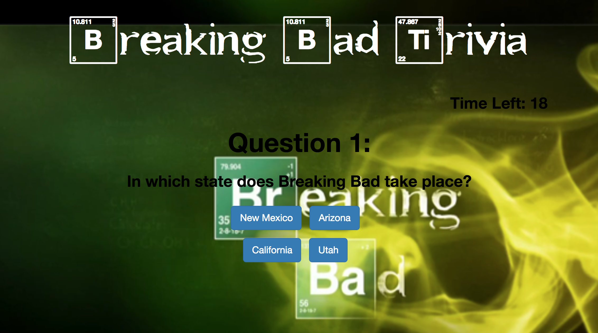

# TriviaGame

Link to game : sefeder.github.io/TriviaGame/

This trivia game utilizes setTimeouts and setIntervals to iterate through several multiple choice question screens on the topic of Breaking Bad.

Technology Used:

    HTML
    CSS/Bootstrap
    JavaScript
    JQuery

Future Verisions:

Future versions of the game will have more questions, easier to read styling, and will have a function that turns the button clicked on to red or green depending on if it was correct or not.
